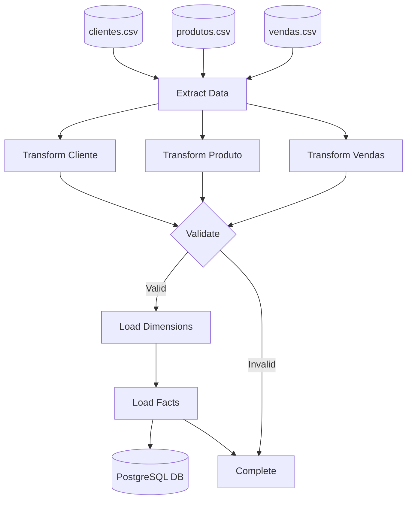

# Mini Data Warehouse - Vendas

A small data warehouse implementation for sales analysis using Python and PostgreSQL.

## Project Structure
```
mini_dw_vendas/
├── data/             
├── etl/               
├── sql/              

## Prerequisites
- Python 3.8+
- PostgreSQL
- pip

## Installation

1. Clone the repository
```bash
git https://github.com/ismaelfranklin/data-warehouse-creation.git
cd mini_dw_vendas
```

2. Create a virtual environment
```bash
python -m venv venv
source venv/Scripts/activate  # Windows
```

3. Install dependencies
```bash
pip install -r requirements.txt
```

4. Configure environment variables
Create a `.env` file with:
```
DB_HOST=localhost
DB_NAME=dw_vendas
DB_USER=your_username
DB_PASSWORD=your_password
DB_PORT=5432
```

## Usage

1. Create database schema:
```bash
psql -U postgres -d dw_vendas -f sql/schema.sql
```

2. Run ETL process:
```bash
python etl/etl_runner.py
```


## Database Model



## License
MIT
